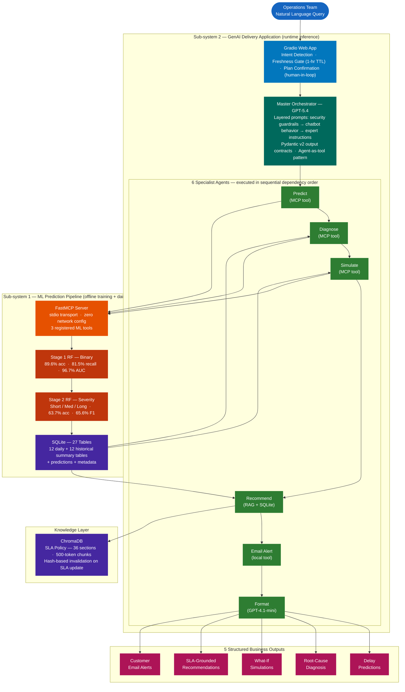

# Executive Presentation — Flow Diagrams

Three complementary diagrams covering the full project. Each is designed to stand alone on a slide.

> **Rendering tip:** Paste any diagram block into [mermaid.live](https://mermaid.live) → export as PNG/SVG for PowerPoint import.

---

## Diagram 1 — System Architecture Overview

*Suggested slide title: "Two-Sub-System Architecture"*

Shows the full system decomposed into its two independently deployable sub-systems, the MCP integration boundary, and all five business outputs. Use this as the "how it all fits together" slide.

**Critical design decisions this diagram illustrates:**

- **Two decoupled sub-systems** — ML pipeline (offline, Python/sklearn) and GenAI app (runtime, OpenAI Agents SDK) are independently deployable. MCP stdio is the only integration boundary, meaning either sub-system can be replaced without touching the other.
- **Sequential dependency enforcement** — the agent chain runs predict → diagnose → simulate → recommend → email → format in strict order. Downstream agents (diagnose, simulate, recommend) read from SQLite tables that the predict step has already written; running them out of order produces explicit MCP errors rather than silent failures.
- **Freshness gate** — sidecar JSON files act as lightweight TTL markers. If prediction data is < 1 hour old, the Master Orchestrator skips the full ML inference step, cutting latency without user intervention.
- **Format Agent isolated** — GPT-4.1-mini (not GPT-5.4) handles pure markdown formatting as the final pass. No security guardrail layer is injected because it is internal-only and never receives raw user text.

---

## Diagram 2 — Multi-Agent Orchestration & Intelligence Design

*Suggested slide title: "From Natural Language to Structured Insight"*

Traces the full execution path of a "Run Full Analysis" query through every system layer. Annotated with the key reliability and security mechanisms at each step. Use this as the "how the AI actually works" slide.

```mermaid
flowchart TD
    classDef user     fill:#1565C0,color:#fff,stroke:none
    classDef ui       fill:#0277BD,color:#fff,stroke:none
    classDef gate     fill:#F57F17,color:#fff,stroke:none
    classDef orch     fill:#00695C,color:#fff,stroke:none
    classDef agent    fill:#2E7D32,color:#fff,stroke:none
    classDef tool     fill:#E65100,color:#fff,stroke:none
    classDef data     fill:#4527A0,color:#fff,stroke:none
    classDef cache    fill:#455A64,color:#fff,stroke:none
    classDef output   fill:#AD1457,color:#fff,stroke:none

    Q(["User: 'Run Full Analysis'\n(or any natural language variant)"]):::user

    subgraph STEP1["Step 1 — Intent & Execution Plan"]
        ID["Intent Detection\nRegex maps query → tool chain\nComposite: 'full analysis' → predict + diagnose + simulate + recommend + email"]:::ui
        FG{"Freshness Gate\nSidecar mtime vs 1-hr TTL\nPer-tool check"}:::gate
        PC["Plan Confirmation\nPresents user with exact steps to run\nHuman approves before any LLM call"]:::ui
    end

    subgraph STEP2["Step 2 — Orchestration  (Master Orchestrator — GPT-5.4)"]
        GUARD["Security Layer\n6 guardrail categories injected first:\nscope restriction  ·  prompt injection defence  ·  data privacy\ntool use boundaries  ·  output safety  ·  escalation handling"]:::orch
        CONTRACT["Pydantic v2 MasterOutput Schema\n11 typed fields aggregated from all specialist agents\nStructurally invalid output rejected before returning to UI"]:::orch
        PATTERN["Agent-as-Tool Pattern\nMaster retains execution control throughout\nHandles retries and error propagation centrally"]:::orch
    end

    subgraph STEP3["Step 3 — Specialist Agent Chain  (in dependency order)"]
        direction LR
        P["Predict Agent\nMCP: predict_delivery_delays\nRF Stage 1 + Stage 2 → writes SQLite 27 tables + prediction CSV\nEnriches each delayed row with LLM-generated insights"]:::agent
        D["Diagnose Agent\nMCP: get_delay_diagnosis\nReads 24 SQLite summary tables\nComputes daily vs historical deltas"]:::agent
        S["Simulate Agent\nMCP: simulate_order_delays\nApplies user-specified condition changes\nRe-scores severity from historical distributions"]:::agent
        R["Recommend Agent\n3-stage RAG: Cosine top-15 → Hybrid top-12 → Cross-encoder top-8\nGrounds 9+ actions in actual SLA policy text"]:::agent
        E["Email Agent\nReads prediction CSV directly\nGenerates severity-matched templates per customer"]:::agent
        F["Format Agent  (GPT-4.1-mini)\nDeterministic Markdown rules only\nNo security layer — internal-only agent"]:::agent
    end

    subgraph STEP4["Step 4 — Tool & Knowledge Execution"]
        direction LR
        MCPS["FastMCP Server\nstdio  ·  3 tools\nML models + SQLite reads"]:::tool
        RAG3["3-Stage RAG Pipeline\ncosine similarity → hybrid 0.7×cosine + 0.3×keyword\n→ cross-encoder ms-marco-MiniLM-L-6-v2  top-8 SLA chunks"]:::data
        SQLITE["SQLite — 27 Tables\nPre-computed aggregates for fast diagnosis + simulation"]:::data
    end

    subgraph CACHE["4 Session Cache Layers  (efficiency without re-running ML)"]
        direction LR
        C1["Sidecar Freshness\nper-tool TTL file"]:::cache
        C2["ChromaDB Embedding\nhash-based invalidation"]:::cache
        C3["RAG Retrieval\nquery-level cache"]:::cache
        C4["Response Cache\nfull agent response"]:::cache
    end

    subgraph STEP5["Step 5 — Gradio UI Render  (5 tabs updated simultaneously)"]
        direction LR
        O1["Predictions\n+ LLM insight per order"]:::output
        O2["Root-Cause\nDiagnosis"]:::output
        O3["What-If\nSimulations"]:::output
        O4["SLA\nRecommendations"]:::output
        O5["Customer\nEmail Alerts"]:::output
    end

    Q --> ID --> FG
    FG -->|"stale or missing"| PC
    FG -->|"fresh  —  skip ML inference"| PC
    PC --> GUARD --> CONTRACT --> PATTERN
    PATTERN --> P --> D --> S --> R --> E --> F
    P --> MCPS
    D --> MCPS
    S --> MCPS
    MCPS --> SQLITE
    R --> RAG3
    SQLITE --> D
    SQLITE --> S
    SQLITE --> R
    CACHE -.->|"skip agent if result cached"| STEP3
    F --> O1 & O2 & O3 & O4 & O5
```

**Critical design decisions this diagram illustrates:**

- **3-layer prompt injection order** — security guardrails are assembled first in `get_instruction()`, making them impossible to override by later prompt sections or user input. Sub-agents never receive raw user text; they only receive structured inputs constructed by the master, so guardrails are correctly centralised.
- **Pydantic v2 contracts as reliability layer** — every specialist agent outputs a typed schema, not free text. MasterOutput aggregates all 11 fields. A hallucinated or structurally wrong response from any agent is caught and rejected before it reaches the UI.
- **Agent-as-tool vs handoff pattern** — Master Orchestrator retains control throughout (agent-as-tool), rather than handing off to a sub-agent that then controls execution (swarms pattern). This enables central error handling, retry logic, and guaranteed sequential dependency.
- **3-stage RAG for grounded recommendations** — using a cross-encoder re-ranker (ms-marco-MiniLM-L-6-v2) as the final stage ensures the top-8 SLA chunks are genuinely the most semantically relevant, not just the closest cosine vectors. Recommendations cite real policy, not hallucinated best practices.
- **4 caching mechanisms eliminate redundant computation** — a full ML inference run takes several seconds. Sidecar freshness check allows any agent to skip its ML call if results are already < 1 hour old; ChromaDB hash invalidation ensures the SLA embedding is automatically refreshed if the policy document changes.

---

## Diagram 3 — ML Two-Stage Prediction Pipeline & Key Findings

*Suggested slide title: "The ML Engine — Feature Engineering Drives Accuracy"*

Traces the full ML pipeline from raw Kaggle data to the two-stage Random Forest models, with the top feature importances and final metrics. Use this as the "what the ML learned" slide — the core analytical finding.

```mermaid
flowchart LR
    classDef raw     fill:#37474F,color:#fff,stroke:none
    classDef prep    fill:#455A64,color:#fff,stroke:none
    classDef feat    fill:#1565C0,color:#fff,stroke:none
    classDef featkey fill:#0D47A1,color:#fff,stroke:none
    classDef split   fill:#4527A0,color:#fff,stroke:none
    classDef stage   fill:#B71C1C,color:#fff,stroke:none
    classDef metric  fill:#1B5E20,color:#fff,stroke:none
    classDef finding fill:#E65100,color:#fff,stroke:none
    classDef db      fill:#4A148C,color:#fff,stroke:none

    DATA["25,000 Logistics Orders\nKaggle  ·  15 raw columns"]:::raw

    subgraph PREP["Data Preparation"]
        direction TB
        CL["Clean + Impute\nStandardise names  ·  parse dates\nRemove post-delivery leakage columns"]:::prep
        EDA["EDA + Outlier Removal\nDescriptive stats  ·  correlation matrix\nClass distribution: 73% on-time  /  27% delayed"]:::prep
        CL --> EDA
    end

    subgraph FENG["Feature Engineering  — Most Analytically Significant Step"]
        direction TB
        INT["Interaction Features\nkm_per_expected_hr  (distance ÷ expected_time)  r ≈ 0.59\nweight_x_distance  ·  cost_per_kg"]:::feat
        ORD["Ordinal Risk Features\nschedule_risk = weather_severity × mode_urgency\nmode_urgency (1–4)  ·  vehicle_load_strain"]:::feat
        AGG["Group Aggregate Features\ncarrier_avg_schedule  (partner-level TTR pattern)\ncarrier_avg_weight  ·  region_avg_distance"]:::feat
        SEL["Feature Selection + OHE\nDrop correlated: cost_per_km  delivery_rating\nOHE post-split (prevent leakage)  →  85–120 features"]:::split
        INT & ORD & AGG --> SEL
    end

    subgraph ST1["Stage 1 — Binary Delay Classification\nDesign decision: optimise for recall  (missed delay >> false alarm cost)"]
        direction TB
        COMP["8 Classifiers Compared\nLR  ·  DT  ·  RF  ·  XGB  ·  LGBM  ·  Ada  ·  SVM  ·  NB"]:::stage
        GRID["Random Forest Selected\nGridSearchCV  3-fold CV  scoring=recall\nn_estimators=200  ·  max_depth=None  ·  class_weight=balanced"]:::stage
        M1["Stage 1 Results\n89.6% accuracy\n81.5% recall\n96.7% ROC-AUC"]:::metric
        COMP --> GRID --> M1
    end

    subgraph FI["Key Finding — Feature Importances (Gini-based after RF training)"]
        direction TB
        KF1["#1  km_per_expected_hr  —  27.1%\nSchedule tightness relative to distance\nSingle strongest predictor  —  overly optimistic windows are the primary delay driver"]:::finding
        KF2["#2  mode_urgency  —  21.5%\nExpress and Same-Day modes compress the window\nHighest SLA risk tier"]:::finding
        KF3["#3  schedule_risk  —  14.9%\nCompounded weather × urgency\nBad weather on a tight-deadline mode amplifies risk non-linearly"]:::finding
        KF4["Top 3 features = 63% of all model decisions\nAll three are engineered features  —  not raw inputs\nNo raw categorical (partner / vehicle / region) in top 5"]:::finding
    end

    subgraph ST2["Stage 2 — Severity Classification  (delayed orders only)\nDesign decision: two-stage vs single 4-class model  (different class distributions require independent tuning)"]
        direction TB
        SUB["Delayed Subset Only  —  27% of total orders\nClass distribution: 50.6% Short  ·  39.7% Medium  ·  11.9% Long\nOption 1 (RF 3-class) vs Option 2 (Frank-Hall ordinal regression)  →  Option 1 wins"]:::stage
        RF2["Random Forest — 3-class Severity\nSame 19 engineered features  ·  independent GridSearchCV\nWeighted F1 as primary metric  (accounts for class imbalance)"]:::stage
        M2["Stage 2 Results\n63.7% accuracy\n65.6% weighted F1\n(harder problem: severity signal weaker than binary signal)"]:::metric
        SUB --> RF2 --> M2
    end

    subgraph ARTIFACTS["Persisted Artifacts"]
        direction TB
        PKL1["Stage 1 .pkl + metadata JSON\nfeature_names_in_  ·  importances  ·  classes"]:::db
        PKL2["Stage 2 .pkl + metadata JSON\nSeverity class definitions  ·  feature config"]:::db
        DB["SQLite — 27 Tables\n12 daily summaries  ·  12 historical summaries\nPredictions + metadata dict\nConsumed by Diagnose / Simulate / Recommend agents"]:::db
    end

    DATA --> CL
    EDA --> INT & ORD & AGG
    SEL --> COMP
    GRID --> KF1 & KF2 & KF3 & KF4
    M1 -->|"delayed rows only"| SUB
    M1 --> PKL1
    M2 --> PKL2
    M2 --> DB
```

**Key ML findings this diagram illustrates:**

- **Feature engineering was the decisive step** — the three engineered features that dominate the model (`km_per_expected_hr`, `mode_urgency`, `schedule_risk`) together account for >63% of all tree split decisions. None of the raw categorical fields (delivery partner, vehicle type, region) appear in the top 5, confirming that raw data alone was insufficient.
- **km_per_expected_hr (r ≈ 0.59) is the primary operational lever** — schedule tightness relative to distance is the single most predictive variable. This means operations teams can directly reduce delay risk by adjusting expected delivery windows, without changing routes or partners.
- **Two-stage design over single 4-class model** — a single multi-class model would have the 73% on-time majority class overwhelm the severity classes during training. Splitting into two stages allows Stage 1 to maximise recall (catching as many delays as possible) and Stage 2 to optimise separately for severity accuracy — objectives that are in direct tension within a single model.
- **Metadata JSON enables safe daily inference** — both `.pkl` files ship with a `feature_names_in_` metadata file. The daily batch prediction script (`daily_predict.py`) reorders and zero-fills columns to exactly match training layout before calling `model.predict()`, preventing silent misalignment when new one-hot columns appear in fresh data.
- **Stage 2 accuracy (63.7%) is expected, not a failure** — severity prediction is a fundamentally harder signal, the 50/40/12 class imbalance makes it genuinely ambiguous, and weighted F1 (65.6%) is the correct metric here. The two-stage chain still enables meaningful operational triage: even a rough severity classification allows prioritised customer communication and logistics re-routing.

---

## Reading Guide for the Presenter

| Diagram | Slide purpose | What to emphasise |
|---|---|---|
| Diagram 1 | Architecture overview | Two independently deployable sub-systems; MCP as clean decoupling boundary; 5 distinct output types |
| Diagram 2 | AI intelligence layer | Security-first prompt architecture; Pydantic contracts prevent hallucination; 3-stage RAG grounds recommendations in real SLA policy |
| Diagram 3 | ML engine + findings | Feature engineering (not model choice) was the key analytical decision; schedule tightness is the #1 lever operations can control; two-stage design was deliberate |
